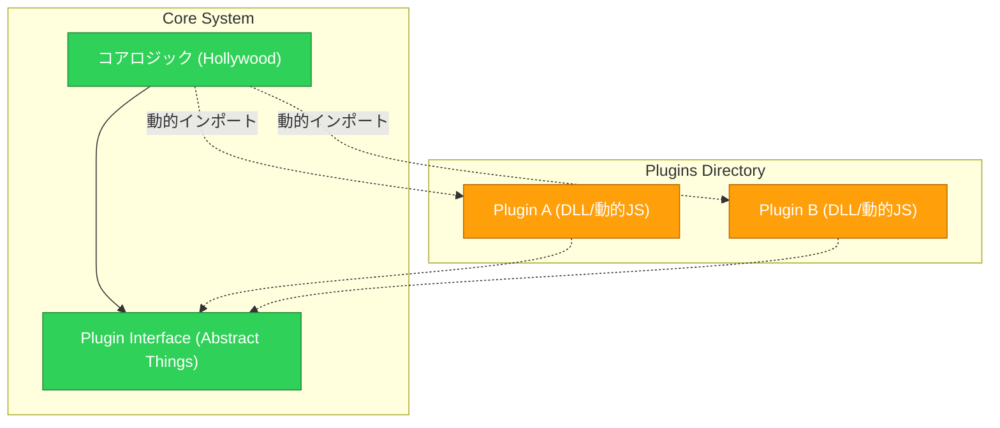
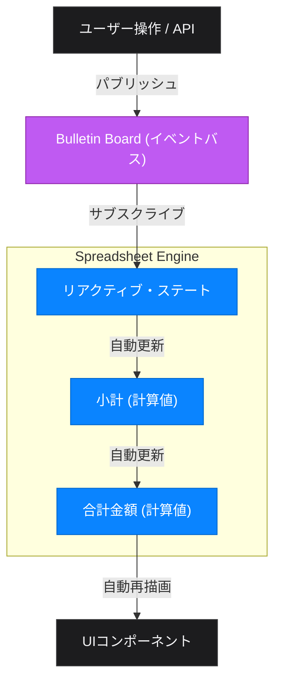
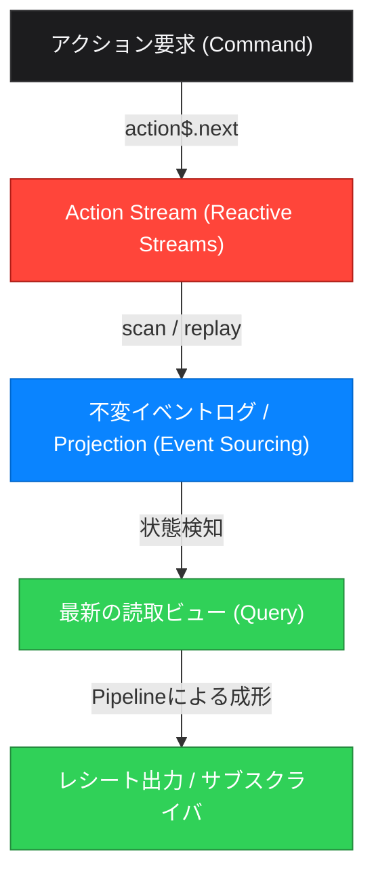

# プログラミングスタイルの相乗効果：組み合わせによる設計の昇華

本プロジェクトで実装した全41のプログラミングスタイルは、それぞれが固有の「制約」とそれに基づく「メリット・デメリット」を持っています。実務における優れたソフトウェア設計とは、単一のスタイルを盲信するのではなく、**それぞれの強みが他方の弱点を補い合うように「文体（スタイル）を組み合わせる」**ことに他なりません。

本ドキュメントでは、複数のスタイルを掛け合わせることで真価を発揮する、代表的かつ強力な「組み合わせレシピ」を紹介します。

---

## レシピ1：堅牢なクリーンデータパイプライン (Robust Data Pipeline)

### 組み合わせるスタイル
*   **06. Pipeline** (計算を純粋関数の直線的な連鎖にする)
*   **24. Intention-Revealing** (例外を使わず、型で正常・異常を明示する)
*   **28. Lazy Rivers** (ジェネレータで必要になるまで計算を遅延する)

### 相乗効果の仕組み
`Pipeline` はデータの流れが視覚的にわかりやすくテストが容易な反面、**「途中で例外が発生すると全体の流れが壊れデバッグしにくい」「大容量データを扱うとメモリが枯渇する」**という二つの弱点があります。

1. **エラーの型安全な伝播:** 各処理の戻り値を `Result<T, Error>` 型（`Intention-Revealing`）にし、パイプラインの中流で `map` や `flatMap` を用いてエラーをラップしたまま下流に流します。これにより、パイプラインを途中でクラッシュさせることなく、最終的な出口で一括してエラー処理が行えます。
2. **メモリ効率の最適化:** パイプラインを流れるデータを配列（一括処理）ではなくジェネレータ（`Lazy Rivers`）に変換します。データは1件ずつパイプ内を流れるため、メモリフットプリントを最小に抑えたまま、クリーンなパイプライン処理を実行できます。

*   **実務でのユースケース:** CSVや巨大JSONログのパース、外部APIからページネーションでデータを引き抜きつつバリデーションと変換を行うETL処理。

---

## レシピ2：拡張自在なマイクロプラグイン (IoC Micro-Plugin)

### 組み合わせるスタイル
*   **14. Abstract Things** (インターフェースで依存関係を抽象化する)
*   **20. Plugins** (実行時に動的に実装モジュールを読み込む)
*   **15. Hollywood** (「呼ぶな、呼び出す」制御反転とイベントフック)

### 相乗効果의 仕組み
`Plugins` はコードベースを書き換えずに機能を追加できる強力な方法ですが、プラグインがコアの具現クラスや複雑なライフサイクルに依存すると、かえって結合度が高まります。

1. **インターフェースによる疎結合化:** コアシステムは `Abstract Things` を用いて、プラグインが実装すべき明確なインターフェース（スキーマ）のみを提供します。
2. **制御の反転 (IoC):** `Hollywood` スタイルに基づき、プラグイン側が主導権を握るのではなく、コアシステムが「プラグインマネージャー」としてプラグインの読み込みや、特定のイベント発生時（例: `onCartAdd`, `beforeCheckout`）のコールバック実行を完全に制御します。

*   **実務でのユースケース:** ECサイトにおける「決済プロバイダの動的追加プラグイン」、テキストエディタのシンタックスハイライト拡張、CMSのフックシステム。

---

## レシピ3：副作用を隔離した高並行メッセージング (Pure Parallel Messaging)

### 組み合わせるスタイル
*   **29. Actors** または **12. Letterbox** (状態を隠蔽しメッセージで並行通信する)
*   **25. Quarantine** (副作用を計算から隔離し、IOコンテナに閉じ込める)

### 相乗効果の仕組み
並行処理やイベント駆動を扱う `Actors` ですが、アクターの中でデータベースアクセスやWeb API呼び出しといった時間のかかる・または失敗しやすい「I/O処理（副作用）」を素朴に行うと、アクターのメッセージキューが詰まり、システム全体の並行スループットが著しく低下します。

1. **副作用の遅延評価・カプセル化:** アクターがメッセージを受け取った際、自身で直接副作用を実行するのではなく、実行すべき副作用の定義を `IO` オブジェクト（`Quarantine`）として構築し、それを返却するか、あるいは「副作用実行専用のアクター（Worker / Gateway Actor）」へ非同期に委ねます。
2. **純粋性の維持:** アクター自身の内部状態は、常に純粋なメッセージパッシングによってのみ遷移するため、非同期状態の不整合や競合状態（Race Condition）を防ぎつつ、副作用のみを安全に外輪へと隔離できます。

*   **実務でのユースケース:** チャットアプリでの「メッセージ受信とDB保存・プッシュ通知送信」の並行処理、分散Webクローラー。

---

## レシピ4：リアクティブ・イベント駆動UI (Reactive Event-Driven Architecture)

### 組み合わせるスタイル
*   **16. Bulletin Board** (中央の掲示板を介して疎結合にイベントを通知する)
*   **27. Spreadsheet** (変数の依存関係を定義し、変更を自動でドミノ伝播させる)

### 相乗効果の仕組み
`Bulletin Board`（パブサブ）はモジュール間を疎結合に保ちますが、多数のイベントが飛び交うと「状態が現在どうなっているか」の追跡が困難になります。一方で `Spreadsheet`（リアクティブ）は依存関係が明快ですが、関係が静的に固定されがちです。

1. **トリガーとしてのイベント:** ユーザー操作や外部からの通知（API呼び出しなど）を `Bulletin Board` にイベントとしてパブリッシュします。
2. **リアクティブな自動状態更新:** イベントを検知した状態管理オブジェクトが特定の値を更新すると、それに依存している他の値（合計金額、割引率、UI表示など）が `Spreadsheet` のように連鎖的に自動再計算されます。これにより、「イベントの伝播」と「状態の整合性」を両立した宣言的なフローが実現します。

*   **実務でのユースケース:** モダンフロントエンド（ReactのContext/Redux + 派生ステート、Vue of Reactive + EventBus）、リアルタイム株価ボード、インタラクティブなダッシュボード。

---

## レシピ5：イベント駆動型CQRSアーキテクチャ (Event-Driven CQRS Architecture)

### 組み合わせるスタイル
*   **43. Event Sourcing** (不変イベントログの蓄積による状態の永続化)
*   **46. Reactive Streams** (非同期イベントのストリーム処理と `scan` による自動状態集約)
*   **06. Pipeline** (出力ビューの関数合成による成形)

### 相乗効果の仕組み
現代の分散システムで広く使われる CQRS (Command Query Responsibility Segregation) パターンを極めて美しく具現化するレシピです。

1.  **書き込みモデル (Command):** ユーザーやシステムからのアクション（コマンド）を、`Reactive Streams` の `action$` ストリームにパブリッシュします。
2.  **不変イベントログと投影 (Event Sourcing):** ストリーム上を流れるアクションの履歴を `scan` オペレータを用いて「不変のイベント配列」として蓄積・リプレイし、読み取り専用の最新状態（Projection / 投影）をリアルタイムに自動構築します。これにより、状態の破壊的更新を防ぎます。
3.  **読み取りモデル (Query):** 投影された最新状態に対して、`Pipeline`（純粋関数合成）を適用し、割引計算やレシート文字列の整形など、プレゼンテーションに応じた様々なビューを切り出して購読者（Subscriber）にプッシュします。

*   **実務でのユースケース:** 高スケーラビリティが要求されるリアルタイム協調編集システム、証跡監査が必要なバンキングAPI、分散型マイクロサービスにおける集計モデル。

---

## レシピ6：極限の宣言的システム (Zero-Imperative System)

### 組み合わせるスタイル
*   **45. Logic Programming** (事実と規則による宣言的なビジネスルールの定義)
*   **42. Point-free** (変数・仮引数を排除した関数合成による制御フロー)

### 相乗効果の仕組み
手続き的制御（`if-else` やループ、変数の再代入）をシステムから完全に排除し、ビジネスルールと処理フローの両方を「宣言的」に統一するアプローチです。

1.  **ルールの定義:** カート追加の妥当性や在庫チェック、割引ルールを「Prolog風の事実（Facts）と規則（Rules）」の形（`Logic Programming`）でアサートします。
2.  **実行の合成:** その判定結果を、引数名や変数名を持たない `Point-free` の関数合成（`pipe`, `ifElse`）に流し込みます。
3.  **相乗効果:** 通常のルールエンジンは評価結果を受け取った後で命令的なコード（`if (check.success) { ... }`）を書きますが、本レシピではその判定からアクションの実行までを一切の変数代入なしで流れるように連結します。人間が介在する「命令（ハウ）」を完全に排除し、「何であるか（ワット）」のみでシステム全体が自律的に動作します。

*   **実務でのユースケース:** 動的に変化する複雑なプロモーション・割引ルールの評価と決済フローの連結、アクセス制御（認可）ポリシーエンジン。

---

## まとめ：アーキテクトとは「文体の調合師」である

プログラミングスタイルの制約は、一見不便に見えますが、組み合わせることによって**「カオスなコードに美しい秩序と防壁をもたらすレール」**へと変貌します。

*   **処理のクリーンさを追求するなら:** `Pipeline` × `Intention-Revealing` × `Lazy Rivers`
*   **システムの拡張性を追求するなら:** `Abstract Things` × `Plugins` × `Hollywood`
*   **並行処理の堅牢性を追求するなら:** `Actors` × `Quarantine`
*   **リアクティブな変化を追求するなら:** `Bulletin Board` × `Spreadsheet`
*   **イベント駆動・高監査性を追求するなら:** `Event Sourcing` × `Reactive Streams` × `Pipeline`
*   **命令性を徹底排除するなら:** `Logic Programming` × `Point-free`

ドメインや直面している問題に応じて、これらの文体を適切にブレンドし、最適なアーキテクチャを「調合」することが、本プロジェクトが目指す極限の設計探求 of ゴールです。
