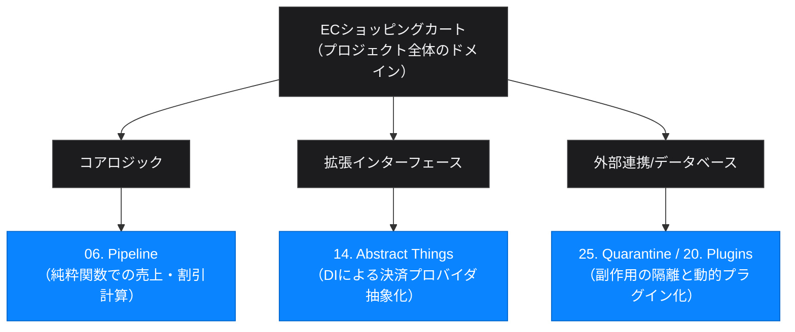

# プログラミングスタイルの光と影：評価の裏にある逆説 (Paradoxical Insights)

本プロジェクトにおける全41のプログラミングスタイルの評価とランキング（[style-ranking.md](./style-ranking.md)）を踏まえ、本ドキュメントでは「一見優れているスタイルが持つ罠（影）」や「一見避けるべきスタイルが持つ極限の価値（光）」、そして生成AI時代におけるプログラミングの文体のあり方について、逆説的かつ多角的な視点から考察します。

---

## 1. ワースト評価されたスタイルの「隠れた超能力」

実務において採用を避けるべきと判断された制約やスタイルも、特定の極限的なコンテキストにおいては「唯一無二の正解」となる二面性を持っています。

### 02. Go Forth (スタックベース) の超極小リソース最適化
*   **一般評価の「影」:** 変数を使用せずスタック操作のみでロジックを組むため、人間の認知負荷が最大であり、バグの温床となる。
*   **逆転の「光」:** **「コンパイラ/インタプリタを実装する難易度が極めて低い」**という最大の強みがあります。メモリ空間が数百バイトから数KBしかなく、高級言語のランタイムはおろか、複雑な構文解析器すら動かせない極小の組み込みマイクロコントローラや、PCが起動する直前のブートローダ（UEFI等）では、極小のフットプリントでハードウェアを直接叩けるForthスタイルこそが、今なお最適解になり得ます。また、すべての計算がスタックの操作に閉じるため、グローバルな状態汚染が原理的に発生せず、数学的モデルによる厳密な形式検証（Formal Verification）と相性が良いという側面もあります。

### 18. Reflective (反射) / 19. Aspects (アスペクト) が支える「現代のDX」
*   **一般評価の「影」:** 実行時に自分自身を書き換えたり、外部からロジックを注入したりするため、静的解析や型チェックのメリットが崩壊し、AIにとっても挙動予測が不可能になる。
*   **逆転の「光」:** 現代のモダン開発者体験（DX）を支えるフレームワーク（TypeScriptのNestJS、JavaのSpring Boot、C#のASP.NET、各種高機能ORM）の**コアエンジンは、100%このメタプログラミングとアスペクト指向によって構築されています**。
    ビジネスロジックに一切ノイズを入れず、「裏側で自動的にログを出力する」「例外をキャッチしてHTTPエラーに変換する」「データベーストランザクションを開始する」といった記述（横断的関心事の分離）は、このスタイルなしには成立しません。「アプリケーション開発者が直接書くのは大罪だが、高度に隠蔽されたインフラ/フレームワークとして恩恵を享受するには神である」という強力なパラドックスが存在します。

---

## 2. ベスト評価されたスタイルに潜む「静かなる毒」

可読性やテスタビリティが高く、「美しい」とされるスタイルも、盲信して過剰に適用するとプロジェクトを機能不全に陥れる罠を含んでいます。

### 06. Pipeline (パイプライン) の「デバッグのブラックボックス化」
*   **一般評価の「光」:** 計算ロジックが純粋関数の直線的な連鎖となるため、データの流れが直感的で、単体テストが極めて容易。
*   **逆転の「影」:** 非同期処理（Promise/Async）や複雑な異常系ハンドリングが混ざった瞬間、**「スタックトレースが破壊され、どこでエラーが発生したのか追跡困難になる」**という問題があります。また、関数間で受け渡されるデータ構造の暗黙的な変化に対する防壁がない場合、パイプラインの下流で突然 `TypeError: Cannot read properties of undefined` が発生し、上流のどの関数が不適切なデータを排出したのかをデバッグするのに多大な認知コストを要します。

### 14. Abstract Things (抽象的なシングス / DI) が招く「抽象化地獄」
*   **一般評価の「光」:** インターフェースにより具現クラスの結合を完全に切り離し、依存性注入（DI）を用いることで、驚異的な拡張性とモックベースのテスト容易性を実現する。
*   **逆転の「影」:** 実装クラスが1つしかないにもかかわらず、ルールとしてすべてのクラスにインターフェースを作成するような過剰な適用は、コードベースのファイル数と複雑さを無駄に倍増させます。コードを読む際、エディタの「定義へ移動」をクリックしても中身のないインターフェース宣言にジャンプするだけで、実処理が書かれた具現クラスに辿り着くためにファイルツリーを彷徨うことになる**「ナビゲーションオーバーヘッド」**を引き起こし、開発スピードをかえって阻害します（YAGNI原則の無視）。

---

## 3. AI駆動開発におけるコペルニクス的転回

生成AI（LLM）や自律型AIエージェントとコードを書き、システムを構築する時代において、プログラミングスタイルの選択はこれまでとは違った「皮肉」と「有用性」を生み出しています。

### 皮肉：AIが得意なスタイルほど「人間の職が失われる」
AI駆動開発において、AIが得意とするのは `Pipeline` や `Abstract Things`、`Intention-Revealing` のような「厳格な型ルールがあり、かつ局所性が高く副作用がないスタイル」です。LLMはこれらのスタイルで書かれたコードを極めて正確に生成し、リファクタリングし、テストまで自動生成します。

これは裏を返せば、**「そのように綺麗に整理されたスタイルで構築できる領域ほど、人間がコードを書く価値は急速にゼロに近づく（AIに完全に任せられる）」**ということを意味します。

一方で、`Go Forth` や `Reflective` のように、静的解析が効かず、グローバルな実行コンテキストの推論や複雑なスタックシミュレーションが必要な「人間でも書くのが難しい黒魔術的スタイル」は、AIにとっても難攻不落のフロンティアとして残ります。皮肉なことに、**「人間がプログラマーとしてAIに対して優位性や創造性を発揮できる領域は、AIが最も苦手とするトリッキーで難解な文体の中に隠されている」**のかもしれません。

### 発見：AIのバグを劇的に減らす「プロンプトとしての文体（スタイル）指定」
LLMにコードの生成を依頼する際、単に「ECショッピングカートを実装して」と頼むと、LLMはインターネット上の平凡なコードを学習した結果として、グローバルな副作用や密結合に満ちた「Cookbook」スタイルに近い、バグを孕みやすいコードを出力しがちです。

しかし、プロンプトにおいて以下のように**文体の制約を課す**ことで、出力コードの品質が劇的に向上します：

*   *「副作用（I/Oや状態更新）を計算ロジックから完全に分離するため、`25. Quarantine`（隔離）スタイルを徹底して書いてください」*
*   *「例外を暗黙的にスローせず、エラーを戻り値の型で表現するため、`24. Intention-Revealing` スタイルで書いてください」*

制約を与えるだけで、LLMの出力する関数は小さく純粋なものになり、結合度が下がり、バグの発生確率が激減します。プログラミングスタイルは、人間がコードを整理するためだけでなく、**「AIの推論品質をコントロールするための強力なレール（ガイド）」**という新しい価値を獲得したのです。

---

## 4. 結論：文体を「道具」として使い分けるメタ思考

『Exercises in Programming Style』の実装から得られる最大の知見は、**「絶対的な正解のスタイルは存在しない」**ということです。ある文体における最大のメリットは、別の文体における致命的なデメリットの裏返しです。

現代の優れたエンジニア（およびAIと協調する開発者）に求められるのは、特定のパラダイムを盲信することではなく、以下のように各文体の「光と影」を理解したうえで、対象とするドメインの要求に応じて文体を自在に選択・ハイブリッドするメタ的な設計能力です。

プログラミングの「文体」は単なる書き方の好みの問題ではなく、**「何を犠牲にし、何を得るか」というエンジニアリングにおける意思決定そのもの**なのです。
